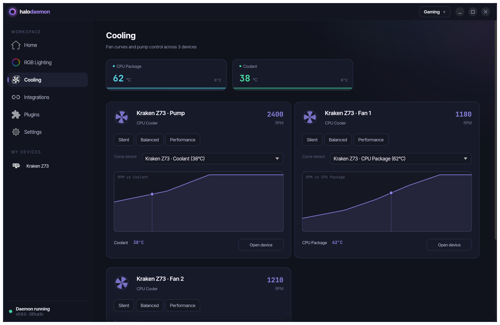
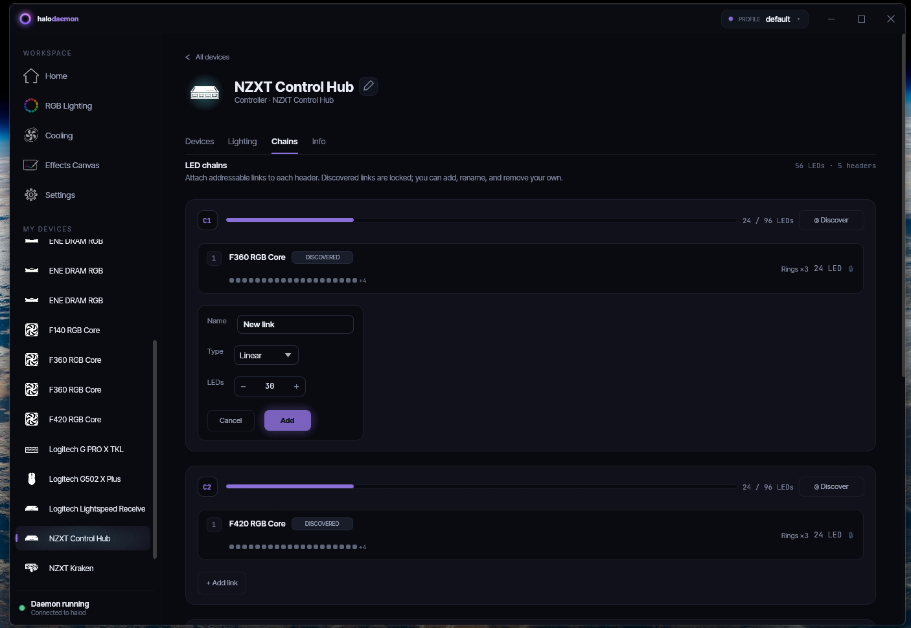
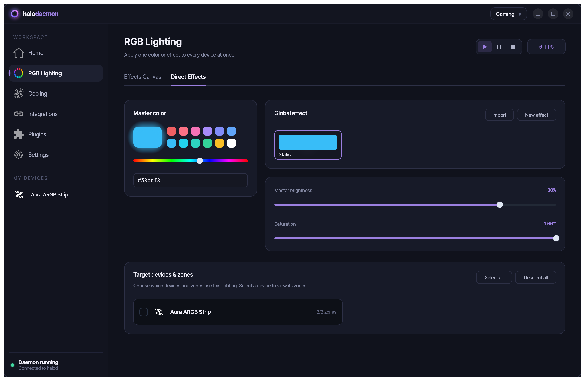
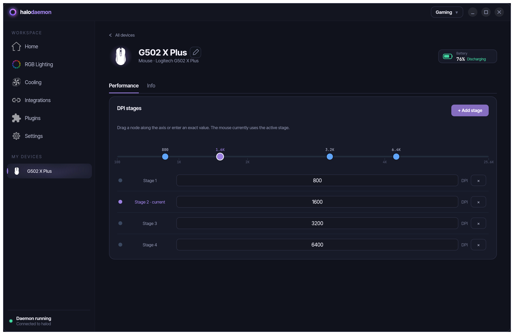
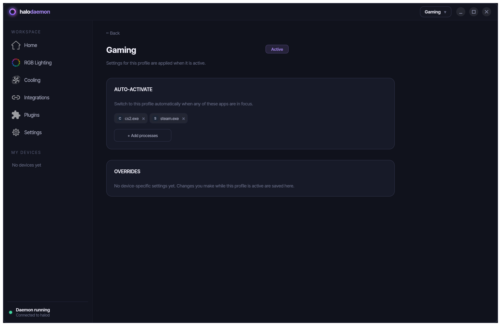
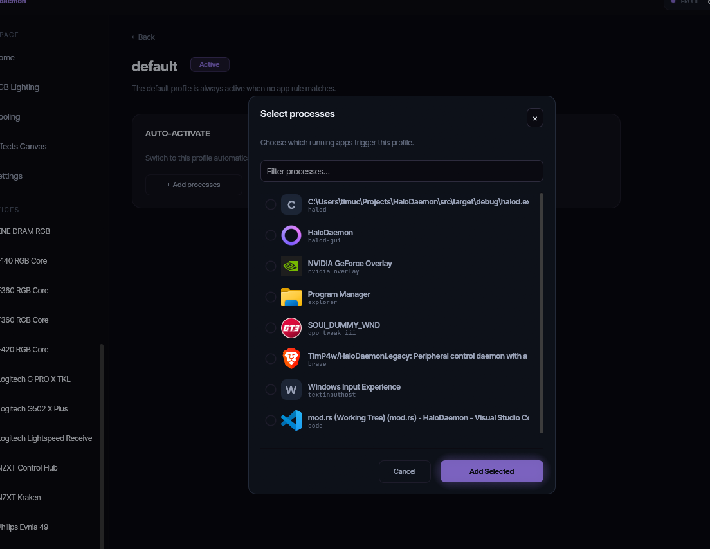
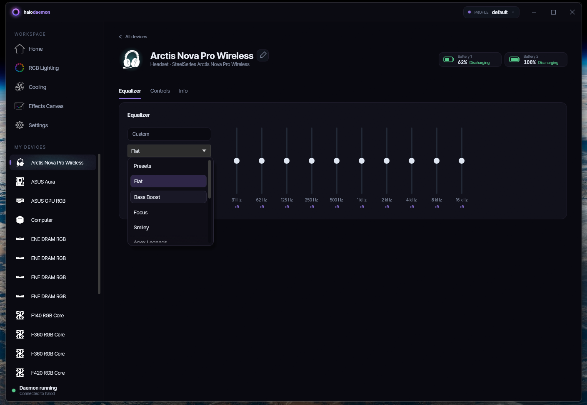
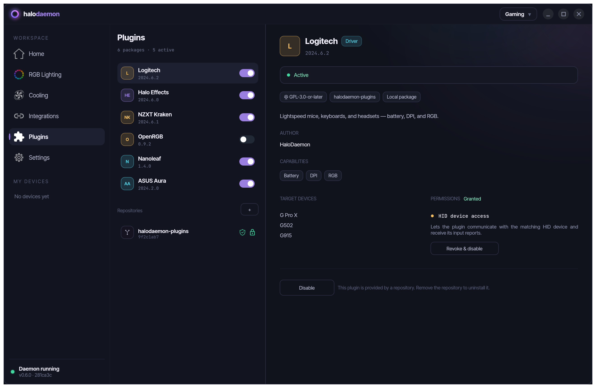

<div align="center">


# HaloDaemon

A scriptable Linux/Windows peripheral control daemon, inspired by SignalRGB.


</div>

Started as a project to learn about HID, in order to remove adware like Aura Sync, G Hub and NZXT Cam, with a first PoC in python, then re-implemented in Rust.

It support my own devices, and some others may be added in the future, mostly following what my friends own.

> [!WARNING]
> **Disclaimer - use at your own risk.** This software communicates directly with low-level hardware interfaces (HID, SMBus/I2C, SuperIO port I/O, etc.). Sending incorrect data to peripherals or your motherboard can cause malfunction, data loss, or **irreparable damage to your peripherals or PC**. It is provided "as is", without warranty of any kind. You assume all responsibility for any damage that results from its use.


## LLM Notice

Claude code was heavily used. The GUI is exclusively done using claude code, the daemon's initial architecture and code was written manually, then iterated over with claude code.

## Features

<table>
<tr>
<td width="50%" valign="top">

**Fan curves** - temperature-based PWM control with hysteresis and failsafe; preset curves (Balanced, Silent, Performance, Full Speed, 50%).

</td>
<td width="50%"></td>
</tr>
<tr>
<td width="50%" valign="top">

**Cooling dashboard** - every pump and fan across your devices in one view, each with its bound sensor, live readout, curve preview, and quick presets.

</td>
<td width="50%"></td>
</tr>
<tr>
<td width="50%" valign="top">

**RGB canvas engine** - unified loop across all placed zones; effects: static color, breathing, rainbow, screen sampler (mirrors monitor content). See [engines](docs/engines.md).

</td>
<td width="50%"></td>
</tr>
<tr>
<td width="50%" valign="top">

**Chainable ARGB** - daisy-chain generic ARGB accessories on supported hubs; user-defined zones placed on the canvas.

</td>
<td width="50%"></td>
</tr>
<tr>
<td width="50%" valign="top">

**LCD display** - template-based image rendering on LCD panel (frame counter, sensor readouts).

</td>
<td width="50%"></td>
</tr>
<tr>
<td width="50%" valign="top">

**Per-led RGB** - full per-led lighting.

</td>
<td width="50%"></td>
</tr>
<tr>
<td width="50%" valign="top">

**Audio-reactive effects & now playing** - RGB effects driven by system audio (beat, level, spectrum, waveform) and an LCD widget showing the current track (MPRIS/GSMTC). See [engines](docs/engines.md).

</td>
<td width="50%"></td>
</tr>
<tr>
<td width="50%" valign="top">

**DPI profiles & onboard profiles** - read/write onboard profile storage; DPI step configuration.

</td>
<td width="50%"></td>
</tr>
<tr>
<td width="50%" valign="top">

**Profiles** - profiles and auto-switch based on focused window.

</td>
<td width="50%"></td>
</tr>
<tr>
<td width="50%" valign="top">

**Battery, Control, Eq, and more** - control device quirks.

</td>
<td width="50%"></td>
</tr>
<tr>
<td width="50%" valign="top">

**Plugin ecosystem** - install device and effect packages from signed repositories; each plugin declares its capabilities and a narrow set of permissions you approve before it runs.

</td>
<td width="50%"></td>
</tr>
</table>

- **ChatMix** - for SteelSeries Arctis Nova
- **Key remap** - divert buttons to custom actions (key chord, mouse button, media key, DPI cycle, macro, command, …)
- **Lua scripting** - implement device plugin callbacks and custom hardware behavior in Lua

---

## Install

- **Linux** (NixOS, Ubuntu/Debian, Fedora, Arch/CachyOS, other distros) - see **[Installing on Linux](docs/install/linux.md)**
- **Windows** - see **[Installing on Windows](docs/install/windows.md)**

Both guides cover the runtime dependencies, permissions/PawnIO setup, and the vendor software (NZXT CAM, iCUE, G HUB, …) you should disable to avoid conflicts.

---

## Further reading

- [Development guide](docs/development.md) - build, add devices, add protocols
- [Device plugins](docs/plugins.md) - declare packages in YAML and implement hardware callbacks in Lua
- [Engines](docs/engines.md) - canvas, fan curve, LCD, key remap
- [Plugin protocols](https://github.com/TimP4w/HaloDaemon-plugins) - each official plugin keeps its protocol documentation in its own `docs/` directory
- [Transports](docs/transports/) - HID, USB control, SMBus, hwmon, LpcIO, AMD SMN, serial, command, TCP, HTTP, UDP

---

## Acknowledgments

HaloDaemon would not exist without the reverse-engineering work and documentation produced by these open-source projects (and others, tracked individually in the [plugin repository](https://github.com/TimP4w/HaloDaemon-plugins)):

| Project | License | Used for |
|---------|---------|----------|
| [LibreHardwareMonitor](https://github.com/LibreHardwareMonitor/LibreHardwareMonitor) | MPL-2.0 | LpcIO via PawnIO |
| [OpenRGB](https://gitlab.com/CalcProgrammer1/OpenRGB) | GPL-2.0-or-later | SMBus, PawnIO |
| [PawnIO modules](https://github.com/namazso/PawnIO_modules) | LGPL-2.1-or-later | Bundled `LpcIO.bin`, `SmbusI801.bin`, `SmbusPIIX4.bin`, `AMDFamily17.bin` for Windows SuperIO / chipset SMBus / AMD SMN access (© 2023 namazso) |

## License

```
HaloDaemon
Copyright (C)  2026 TimP4w and contributors

This program is free software: you can redistribute it and/or modify
it under the terms of the GNU General Public License as published by
the Free Software Foundation, either version 3 of the License, or
(at your option) any later version.

This program is distributed in the hope that it will be useful,
but WITHOUT ANY WARRANTY; without even the implied warranty of
MERCHANTABILITY or FITNESS FOR A PARTICULAR PURPOSE.  See the
GNU General Public License for more details.

You should have received a copy of the GNU General Public License
along with this program.  If not, see <http://www.gnu.org/licenses/>.
```
