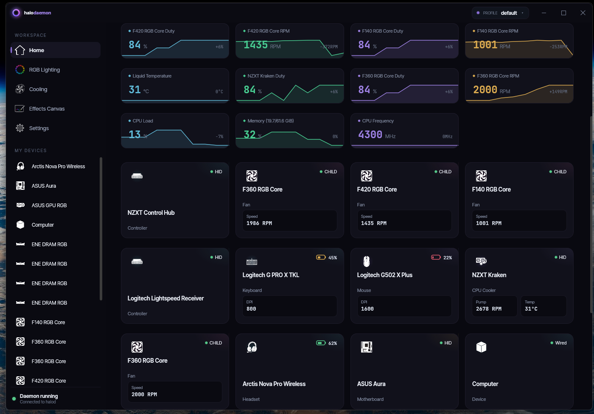
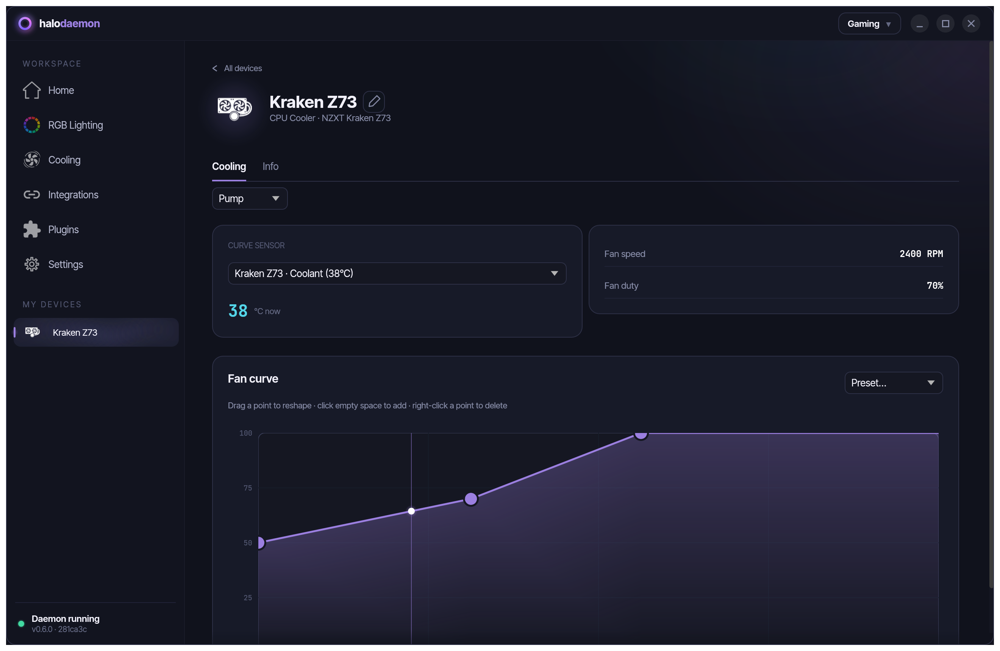
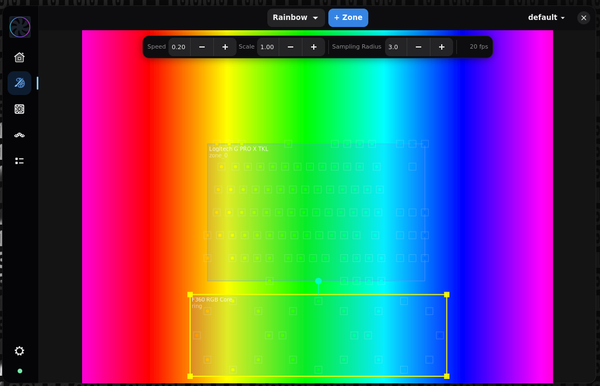
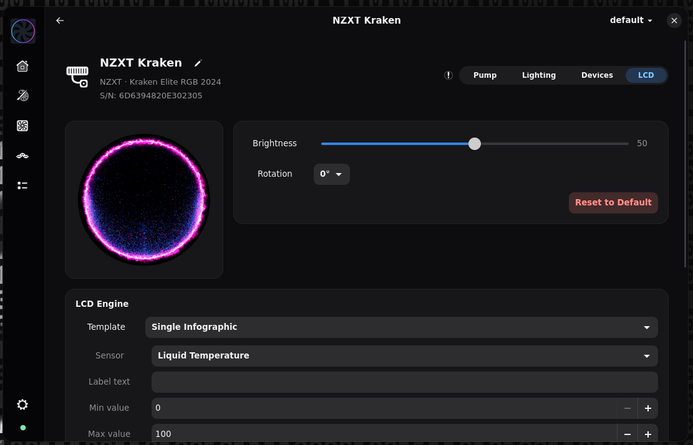
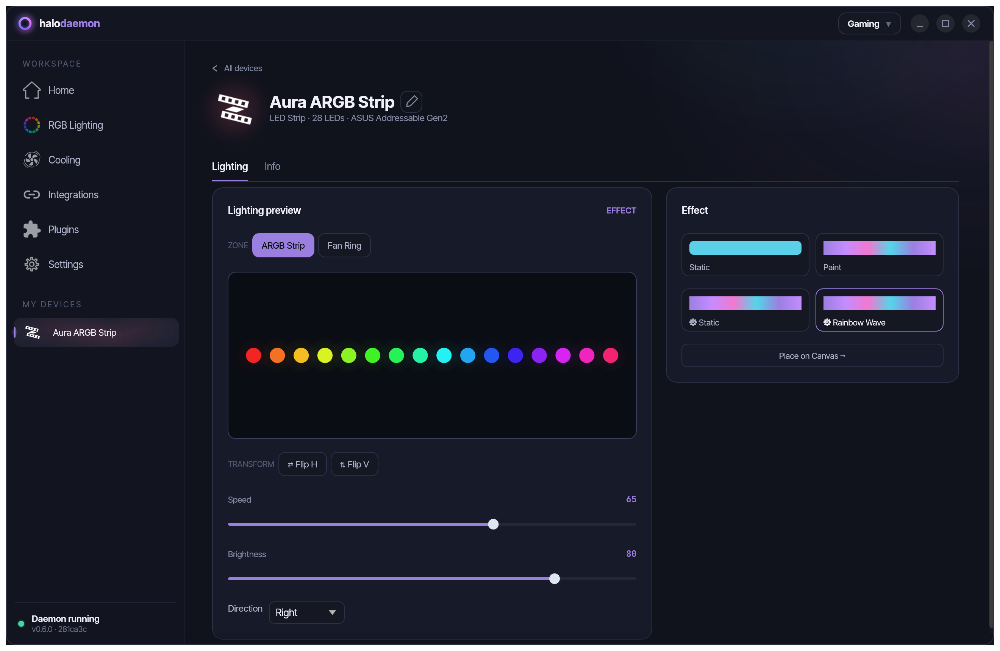

# HaloDaemon


A Linux/Windows peripheral control daemon, inspired by SignalRGB.

Started as a project to learn about HID, in order to remove adware like Aura Sync, G Hub and NZXT Cam, with a first PoC in python, then re-implemented in Rust.

It support my own devices, and some others may be added in the future, mostly following what my friends own.




> [!WARNING]
> **Disclaimer - use at your own risk.** This software communicates directly with low-level hardware interfaces (HID, SMBus/I2C, SuperIO port I/O, etc.). Sending incorrect data to peripherals or your motherboard can cause malfunction, data loss, or **irreparable damage to your peripherals or PC**. It is provided "as is", without warranty of any kind. You assume all responsibility for any damage that results from its use.


## LLM Notice

Claude code was heavily used. The GUI is exclusively done using claude code, the daemon's initial architecture and code was written manually, then iterated over with claude code.

## Features

- **Fan curves** - temperature-based PWM control with hysteresis and failsafe; preset curves (Balanced, Silent, Performance, Full Speed)

- **RGB canvas engine** - unified loop across all placed zones; effects: static color, breathing, rainbow, screen sampler (mirrors monitor content); see [engines](docs/engines.md)

- **Chainable ARGB** - daisy-chain generic ARGB accessories on supported hubs; user-defined zones placed on the canvas
- **LCD display** - template-based image rendering on LCD panels (frame counter, sensor readouts)

- **Per-led RGB** - full per-led lighting

- **DPI profiles & onboard profiles** - read/write onboard profile storage; DPI step configuration
- **ChatMix** - for SteelSeries arctis nova
- **Battery** - live battery level
- **Key remap** - divert buttons to custom actions (key chord, mouse button, media key, DPI cycle, macro, command, …) 

---

## Supported Devices

### AIO Coolers

| Vendor | Model | VID:PID | Protocol | Transport | Platform |
|--------|-------|---------|----------|-----------|----------|
| NZXT | Kraken X53, X63, X73 | 1e71:2007, 1e71:2014 | [NZXT](docs/protocols/nzxt.md) | [HID](docs/transports/hid.md) | 🐧🪟 |
| NZXT | Kraken Z53, Z63, Z73 | 1e71:3008 | [NZXT](docs/protocols/nzxt.md) | [HID](docs/transports/hid.md) | 🐧🪟 |
| NZXT | Kraken Elite 2023 | 1e71:300c | [NZXT](docs/protocols/nzxt.md) | [HID](docs/transports/hid.md) | 🐧🪟 |
| NZXT | Kraken 2023 | 1e71:300e | [NZXT](docs/protocols/nzxt.md) | [HID](docs/transports/hid.md) | 🐧🪟 |
| NZXT | Kraken Elite RGB 2024 | 1e71:3012 | [NZXT](docs/protocols/nzxt.md) | [HID](docs/transports/hid.md) | 🐧🪟 |
| NZXT | Kraken Plus 2024 | 1e71:3014 | [NZXT](docs/protocols/nzxt.md) | [HID](docs/transports/hid.md) | 🐧🪟 |

### Fans & Controllers

| Vendor | Model | VID:PID | Protocol | Transport | Platform |
|--------|-------|---------|----------|-----------|----------|
| NZXT | Control Hub | 1e71:2022 | [NZXT](docs/protocols/nzxt.md) | [HID](docs/transports/hid.md) | 🐧🪟 |
| NZXT | F120/F140/F240/F360/F420 RGB (via Control Hub) | — | [NZXT](docs/protocols/nzxt.md) | [HID](docs/transports/hid.md) | 🐧🪟 |
| (All) | Motherboard fan headers | — | sysfs | [hwmon](docs/transports/hwmon.md) | 🐧 |
| (All) | Motherboard fan headers (NCT677x) | — | PawnIO | [LpcIO](docs/transports/lpcio.md) | 🪟 |

### Mice

| Vendor | Model | VID:PID | Protocol | Transport | Platform |
|--------|-------|---------|----------|-----------|----------|
| Logitech | G502 X Plus (wired | wireless) | 046d:c095 | [HID++](docs/protocols/hidpp.md) | [HID](docs/transports/hid.md) | 🐧🪟 |

### Keyboards

| Vendor | Model | VID:PID | Protocol | Transport | Platform |
|--------|-------|---------|----------|-----------|----------|
| Logitech | G PRO X TKL (wired | wireless) | 046d:c352 | [HID++](docs/protocols/hidpp.md) | [HID](docs/transports/hid.md) | 🐧🪟 |

### Headsets

| Vendor | Model | VID:PID | Protocol | Transport | Platform |
|--------|-------|---------|----------|-----------|----------|
| SteelSeries | Arctis Nova Pro Wireless | 1038:12e0 | [SteelSeries](docs/protocols/steelseries-arctis.md) | [HID](docs/transports/hid.md) | 🐧🪟 |
| SteelSeries | Arctis Nova Pro X Wireless | 1038:12e5 | [SteelSeries](docs/protocols/steelseries-arctis.md) | [HID](docs/transports/hid.md) | 🐧🪟 |

### Speakers

| Vendor | Model | VID:PID | Protocol | Transport | Platform |
|--------|-------|---------|----------|-----------|----------|
| Logitech | G560 Gaming Speaker | 046d:0a78 | [HID++ 1.0](docs/protocols/hidpp.md) | [HID](docs/transports/hid.md) | 🐧🪟 |

### Monitors

| Vendor | Model | VID:PID | Protocol | Transport | Platform |
|--------|-------|---------|----------|-----------|----------|
| Philips | Evnia 49 Ultrawide (DDC/CI) | 2109:8884 | [DDC/CI](docs/protocols/ddc-ci.md) | [USB control](docs/transports/usb-control.md) | 🐧🪟 |
| Philips | Evnia 49 Ambiglow (rear LEDs) | 0cf2:b201 | [Philips Ambiglow](docs/protocols/philips-ambiglow.md) | [USB control](docs/transports/usb-control.md) | 🐧🪟 |

### Motherboard / RGB Controllers

| Vendor | Model | VID:PID | Protocol | Transport | Platform |
|--------|-------|---------|----------|-----------|----------|
| ASUS | Aura USB controllers | 0b05:1866, 1867, 1872, 18a3, 18a5, 18f3, 1939, 19af, 1a30, 1a6c, 1aa6, 1b3b, 1bed | [ASUS Aura USB](docs/protocols/asus-aura-usb.md) | [HID](docs/transports/hid.md) | 🐧🪟 |
| ASUS/ENE | SMBus RGB (DRAM, GPU) | — | [ENE SMBus](docs/protocols/ene-smbus.md) | [SMBus](docs/transports/smbus.md) | 🐧🪟 |
| Corsair | Vengeance / Dominator DDR4/DDR5 DRAM RGB | — | [Corsair DRAM](docs/protocols/corsair-dram.md) | [SMBus](docs/transports/smbus.md) | 🐧🪟 |

### Sensors

| Source | VID:PID | Transport | Platform |
|--------|---------|-----------|----------|
| CPU / motherboard temperatures | — | [hwmon](docs/transports/hwmon.md) | 🐧 |
| Motherboard temperatures (NCT677x) | — | [LpcIO](docs/transports/lpcio.md) | 🪟 |
| GPU temperatures (NVIDIA NVAPI) | — | — | 🪟 |

---

## Install

### NixOS

The flake exposes a NixOS module:

```nix
# flake.nix
inputs.halod.url = "github:TimP4w/HaloDaemon";

# configuration.nix
imports = [ inputs.halod.nixosModules.default ];
programs.halod.enable = true;
users.users.<you>.extraGroups = [ "i2c" ];  # for SMBus / DRAM RGB

kernelModules = [
  "i2c-dev"
  "i2c-piix4"
  "nct6775" # Motherboard nuvoton chip (for controlling fans)
];
```

This installs the binaries, udev rules, and runs `halod` as a per-user service. It also loads `nct6775` at boot — the Linux kernel driver for Nuvoton NCT677x SuperIO chips (found on most AMD and Intel consumer motherboards). Without it, motherboard temperature sensors and PWM fan headers are not visible to HaloDaemon. The module is a no-op if your board uses a different SuperIO chip.

To try without installing: `nix run github:TimP4w/HaloDaemon`.

### Linux (other distros, untested)

Download `halod-linux-x64.tar.gz` from the [releases page](https://github.com/TimP4w/HaloDaemon/releases), or build from source — see [development guide](docs/development.md).

**Runtime dependencies:**

| Package | Notes |
|---------|-------|
| gtk4 | UI toolkit |
| libadwaita | GTK4 addon widgets |
| hidapi | USB HID communication |
| libusb1 | Raw USB transfers |
| pipewire / pulseaudio | Audio (optional, screen capture) |
| libudev | Device discovery |
| wayland | Wayland compositor support |
| dbus | Foreground app detection |

**udev rules** (required — without these the daemon needs root):
```bash
sudo cp udev/60-halod.rules /etc/udev/rules.d/
sudo udevadm control --reload-rules
sudo udevadm trigger
sudo usermod -aG input,i2c $USER   # log out and back in after this
```

The `i2c` group is only needed for SMBus/DRAM RGB (ASUS/ENE, Corsair DRAM). For motherboard PWM fan control via hwmon the udev rules grant the necessary permissions automatically on device add.

**Motherboard fans (NCT677x):** if your board uses a Nuvoton NCT677x SuperIO chip, load the kernel module:
```bash
modprobe nct6775
```
Add it to `/etc/modules-load.d/` to persist across reboots.

**Screen capture (canvas screen sampler):** ensure `xdg-desktop-portal` is running:
```bash
systemctl --user enable --now xdg-desktop-portal
```

### Windows

Download `halod-setup-x64.exe` from the [releases page](https://github.com/TimP4w/HaloDaemon/releases) and run it. The installer registers the daemon as a Windows service and installs the UI. The UI can be launched in the background (without showing a window) via `halod-gui --background` for autostart entries.

**PawnIO (required for DRAM RGB and motherboard fan control):**

Chipset SMBus access (ASUS/ENE DRAM RGB, Corsair DRAM RGB) and SuperIO fan control (NCT677x temperature sensors and PWM headers) require the [PawnIO](https://pawnio.eu/) signed kernel driver. PawnIO provides safe, signed port I/O from user space without needing full kernel patches.

On first launch the daemon prompts for Administrator elevation via UAC and relaunches itself elevated. Declining the UAC prompt is non-fatal, the daemon keeps running, but chipset SMBus and SuperIO devices will not be available.

---

## Further reading

- [Development guide](docs/development.md) — build, add devices, add protocols
- [Engines](docs/engines.md) — canvas, fan curve, LCD, key remap
- [Protocols](docs/protocols/) — HID++, NZXT, ENE SMBus, DDC/CI, ASUS Aura USB, Corsair, SteelSeries
- [Transports](docs/transports/) — HID, SMBus, hwmon, LpcIO, USB control

---

## Acknowledgments

HaloDaemon would not exist without the reverse-engineering work and documentation produced by these open-source projects:

| Project | License | Used for |
|---------|---------|----------|
| [Solaar](https://github.com/pwr-Solaar/Solaar) | GPL-2.0-or-later | Logitech HID++ protocol (feature pages, onboard profiles, RGB effects) |
| [OpenRGB](https://gitlab.com/CalcProgrammer1/OpenRGB) | GPL-2.0-or-later | ENE SMBus, ASUS Aura USB, Corsair DRAM, Zotac GPU protocols |
| [liquidctl](https://github.com/liquidctl/liquidctl) | GPL-3.0 | NZXT Kraken protocol |
| [Linux kernel nzxt-smart2](https://github.com/torvalds/linux/blob/master/drivers/hwmon/nzxt-smart2.c) | GPL-2.0-or-later | NZXT Control Hub protocol |
| [LibreHardwareMonitor](https://github.com/LibreHardwareMonitor/LibreHardwareMonitor) | MPL-2.0 | NCT677x SuperIO register map |
| [linux-arctis-manager](https://github.com/elegos/Linux-Arctis-Manager) | GPL-3.0 | SteelSeries Arctis protocol |
| [G560-led](https://github.com/claudiosanches/g560-led) | MIT | Logitech G560 protocol |

## License

```
HaloDaemon
Copyright (C)  2026 TimP4w and contributors

This program is free software: you can redistribute it and/or modify
it under the terms of the GNU General Public License as published by
the Free Software Foundation, either version 3 of the License, or
(at your option) any later version.

This program is distributed in the hope that it will be useful,
but WITHOUT ANY WARRANTY; without even the implied warranty of
MERCHANTABILITY or FITNESS FOR A PARTICULAR PURPOSE.  See the
GNU General Public License for more details.

You should have received a copy of the GNU General Public License
along with this program.  If not, see <http://www.gnu.org/licenses/>.
```
